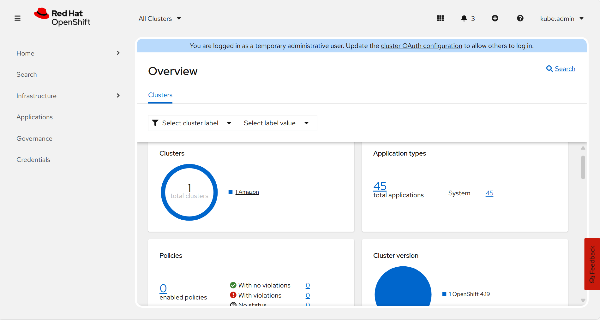
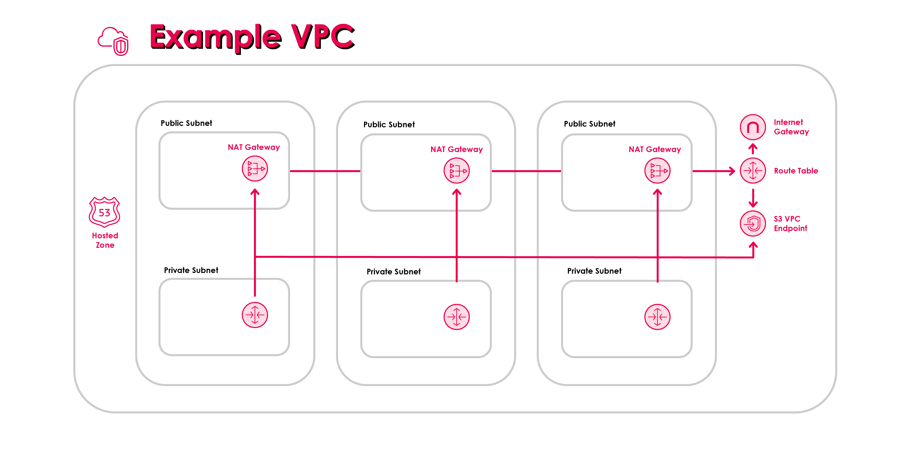
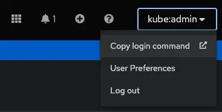
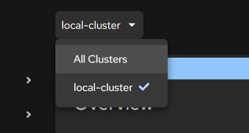

# Red Hat Advanced Cluster Management AWS - Lab

In this lab we will setup a Single Node Openshift Cluster in AWS which will serve as our RHACM (Red Hat Advanced Cluster Management) hub



## Topology



> This lab doesn't include an S3 VPC Endpoint

From: https://github.com/openshift/installer/blob/main/docs/user/aws/install_upi.md

We deploy a **Single-Node OpenShift (SNO)** cluster into a **custom VPC** which is created via Terraform. We then install **RHACM** on that cluster to act as the hub. Networking is split across **public** and **private** subnets, with **one NAT Gateway per AZ** for egress from private subnets.

VPC (e.g., 10.0.0.0/16)
Attributes: enableDnsSupport = true, enableDnsHostnames = true

[ Public subnets ] (one per AZ used)

- Route → Internet Gateway (IGW)
- NAT Gateway in each public subnet (each with its own Elastic IP)
- Hosts public-facing load balancers if you choose a “public” cluster

[ Private subnets ] (one per AZ used; SNO lives here)

- Route → NAT Gateway in the same AZ
- SNO EC2 instance (control plane + workloads)
- Internal load balancers if you choose a “private” cluster

[ Optional VPC Endpoints ]

- S3, EC2, ECR, STS, ELB, etc. (reduce NAT traffic / keep AWS API traffic private)

### What runs where

- **SNO node (EC2):** one instance in a **private subnet**; this becomes the entire OpenShift cluster.
- **Load balancers (created by the installer):**
  - **API (NLB)** and **Ingress (NLB/ALB)**.
  - **Public cluster:** LBs are **internet-facing** in **public subnets**.
  - **Private cluster (common for hubs):** LBs are **internal** in **private subnets**.
- **RHACM hub:** installed via Operator on the SNO cluster after it comes up.

### Custom VPC requirements you must meet

- **Subnets & AZ layout:** Provide **one public + one private subnet per AZ** you plan to use (SNO can be single-AZ).  
  Public subnets route to the **IGW**; private subnets route to the **NAT in the same AZ**.
- **Egress model:** A **NAT Gateway per AZ** is required if you want zonal independence and to avoid cross-AZ data charges; your Terraform follows this pattern.
- **VPC DNS:** Turn on **DNS support** and **DNS hostnames** in the VPC so Route 53 / internal DNS works.
- **Tags:** Allow the installer to tag your subnets with `kubernetes.io/cluster/<infra-id>: shared`. Don’t pre-tag them as `…: owned`.
- **DNS zone (optional):** If you use a **private Route 53 hosted zone**, associate it with the VPC before install and reference it via `platform.aws.hostedZone` in `install-config.yaml`.
- **Outbound access:** The cluster needs HTTPS egress for images and updates. Options:
  - NAT only (what the Terraform sets up),
  - NAT + **VPC Endpoints** (S3/ECR/etc.) to lower NAT cost/latency,
  - or an **HTTP(S) proxy** with a correct `noProxy`.

### How this aligns with the Terraform

We use the Terraform files included in this lab to create the Custom VPC

- Creates a **VPC** with `enableDnsSupport=true` and `enableDnsHostnames=true`.
- Builds **public and private /24 subnets** across up to **three AZs**, paired per AZ.
- Stands up **one NAT Gateway per public subnet** (therefore per AZ), each with its own **Elastic IP**.
- Associates **public route tables** (0.0.0.0/0 → IGW) to public subnets and **private route tables** (0.0.0.0/0 → the AZ’s NAT) to private subnets.
- Leaves load balancers, cluster DNS records, and cluster tags to be created by the **OpenShift installer**.

# Install single node OpenShift on AWS

## Create the VPC via Terraform

This module builds an **existing VPC layout** that OpenShift expects:

- a VPC with DNS **enabled**
- **public + private** subnets in 1–3 AZs
- an **Internet Gateway** for the public subnets
- **NAT Gateway(s)** for the private subnets
- route tables + routes
- handy outputs: **VPC ID** and **subnet IDs** to paste into `install-config.yaml`

> ⚠️ **Costs**: NAT Gateways and Elastic IPs incur hourly + data charges. For labs, you can use a **single NAT** to save cost.

### Use the terraform files in the `terraform/openshift_vpc` directory

#### Fill in the placeholders with your own values

Edit these files/vars:

1. **`providers.tf` → AWS region**

   - It’s hard-coded to `us-east-2`:
     ```hcl
     provider "aws" { region = "us-east-2" }
     ```
   - Change this if you want a different region (e.g., `us-east-1`).

2. **`variables.tf` → VPC name and CIDR**

   - `vpc_name` — used for resource **tags** (not an AWS “VPC Name” object).
     ```hcl
     variable "vpc_name" { default = "openshift_vpc" }
     ```
   - `vpc_cidr` — the VPC CIDR (must contain your `machineNetwork.cidr` from `install-config.yaml`).
     ```hcl
     variable "vpc_cidr" { default = "10.0.0.0/16" }
     ```

3. **`variables.tf` → Which subnets to create (per-AZ)**
   The module defines **maps** where the **key is a label** you choose and the **value is an AZ index** (0-based) into
   `data.aws_availability_zones.available.names`.

   - **Public subnets**

     ```hcl
     variable "public_subnets" {
       default = {
         "public_subnet_1" = 0
         # "public_subnet_2" = 1
         # "public_subnet_3" = 2
       }
     }
     ```

     - To create more public subnets, you can **uncomment** the other subnets and/or add more lines for even more subnets
     - Index **0** is the first AZ in your region, **1** is the second, and so on.

   - **Private subnets**
     ```hcl
     variable "private_subnets" {
       default = {
         "private_subnet_1" = 0
         # "private_subnet_2" = 1
         # "private_subnet_3" = 2
       }
     }
     ```
     - Create a **matching private subnet** for each public subnet (same index) if you want a public+private pair per AZ (typical for `publish: External`).

4. **NAT/EIP costs (important)**
   Your `main.tf` creates an **EIP and NAT Gateway for each public subnet**:

   ```hcl
   resource "aws_eip" "nat_gateway_eip" { for_each = aws_subnet.public_subnets ... }
   resource "aws_nat_gateway" "nat_gateway" { for_each = aws_subnet.public_subnets ... }
   ```

   > That means one NAT per AZ. Great for HA, but it costs more. Keep only one public + private pair (index 0) in labs if you want to minimize spend.

#### Run a `terraform apply` on those files

#### Grab the outputs for the subnet ids

```bash
terraform output
```

#### Place the ids into the `install-config.yaml` file:

```yaml
platform:
  aws:
    region: us-east-1
    subnets:
      - <PUBLIC_SUBNET_ID>
      - <PRIVATE_SUBNET_ID>
```

## Create DNS with Route 53 (public zone)

OpenShift needs public DNS names such as `api.<cluster>.<domain>` and `*.apps.<cluster>.<domain>`. The installer will create those records **inside a Route 53 hosted zone** for your domain, you just need to set up the domain (and zone) in your AWS account.

> Based on the workflow described in Red Hat’s article: https://developers.redhat.com/articles/2024/04/29/how-install-single-node-openshift-aws?utm_source=chatgpt.com#creating_the_iam_user

1. **Open Route 53 → Registered domains → Register domain**

   - In the search box, enter a name (e.g., `acmdemo.com`) and choose **Search**.

2. **Pick the domain & term**

   - If available, choose the domain.
   - Select the **registration period** (1+ years) and (optional) **auto-renew**.

3. **Enter contact details**

   - Contact type (person/company), name, email, address, phone.
   - Leave **Privacy protection** ON unless you have a reason to expose WHOIS info.

4. **Review & purchase**

   - Accept the terms and submit. You may be asked to verify the registrant email.

5. **Confirm the hosted zone exists**

   - Route 53 automatically creates a **Public hosted zone** with the same name as your domain.
   - Check **Route 53 → Hosted zones**; you should see your domain with NS + SOA records.

6. **(CLI verify, optional)**

Run the following command to verify that the hosted zone is present

```bash
# List your zones and copy the HostedZoneId for your new domain
aws route53 list-hosted-zones
```

## Create a dedicated IAM identity for OpenShift (via Terraform)

Even though your AWS account has an admin user, it’s best practice to create a **separate, least-privilege IAM user (or role)** for the OpenShift install and day-to-day cluster operations. Using a dedicated identity isolates credentials, makes key rotation/revocation safer, and gives you clearer **CloudTrail** audit trails for what the cluster changes in your AWS account.

Create an IAM user with **programmatic access** and attach the required policies for OpenShift, or use an **IAM role** that you assume via STS. Store the access keys in your local environment or a secrets manager—**never in Git**.

### OPTION A

Run the following terraform commands on the `.tf` files in the `terraform/openshift_prereqs` directory:

```bash
terraform init
terraform plan
terraform apply
```

Get the access key values for the admin user you created (save these for later):

```bash
terraform output
terraform output -raw os_admin_secret_key
```

### OPTION B (if you don’t have an “admin” group):

Create one and attach the AdministratorAccess policy (lab/demo use only). Replace the data source in the main.tf file with this:

```hcl
resource "aws_iam_group" "admin" {
  name = "admin"
}

resource "aws_iam_group_policy_attachment" "admin_attach" {
  group = aws_iam_group.admin.name
  policy_arn = "arn:aws:iam::aws:policy/AdministratorAccess"
}

resource "aws_iam_user_group_membership" "admin_membership" {
  user = aws_iam_user.os_admin.name
  groups = [aws_iam_group.admin.name]
}
```

Then run `terraform apply`

## Create the Admin Host (via Vagrant)

This VM is your **workstation in the lab**—the place you’ll run the `oc` and `openshift-install` commands. You can reuse the **PXE server Vagrantfile** from the previous PXE OpenShift lab.

https://github.com/notsnapback/openshift-sno-pxe-vagrant-lab/tree/main?tab=readme-ov-file

> This is optional and you can pick a different Admin Host or Workstation if you please. The reason I've decided to include the PXE server vm as an option is so you can use the preexisting oc tool in order to import the SNO cluster you created in the previous lab. It's not mandatory but it does make things more convenient. Please refer to the previous labs for creating the VM.

## Installing the AWS CLI

The installer will use the credentials from the IAM identity you created earlier to create your OpenShift cluster in AWS. In order to authenticate the VM with the IAM identity follow the steps below to install the AWS CLI:

> Make sure that fapolicyd (File Access Policy Daemon) is disabled before installing the AWS CLI."The File Access Policy Daemon, fapolicyd, is a service that can be used to help protect a system by limiting which applications have permission to run" - Oracle's Docs. The protection that fapolicyd offers can interfere with the installation process of the AWS CLI. To disable it run the following below:

```bash
systemctl stop fapolicyd
systemctl disable fapolicyd
```

> Oracle's Documenation on fapolicyd: https://docs.oracle.com/en/operating-systems/oracle-linux/8/fapolicyd/fapolicyd-About.html

Run the following commands to install the AWS CLI:

```bash
curl "https://awscli.amazonaws.com/awscli-exe-linux-x86_64.zip" -o "awscliv2.zip"
unzip awscliv2.zip
sudo ./aws/install
aws --version
```

To authenticate with the IAM identity you created earlier run the command below and fill in the `Access Key ID`, `Secret Access Key`, `region`, and `output format`:

```bash
aws configure
```

## SSH key pair creation

The installer needs an **SSH public key** so you can log in to the node for
troubleshooting. The key you provide is embedded in the ignition config and, on
first boot, RHCOS writes it to `/home/core/.ssh/authorized_keys` for the
**`core`** user. That enables password-less SSH access.

1. Run the following command to create the SSH keys:

```bash
ssh-keygen -t ed25519 -N '' -f ${HOME}/.ssh/ocp4-aws-key
```

2. Copy your new public key

```bash
cat ${HOME}/.ssh/ocp4-aws-key.pub
```

## Installing the OCP client and the installation program

If you're using the PXE Server VM from previous labs you should already have the OpenShift tools. If not run the following commands:

```bash
# Download client + installer (RHEL9 builds)
wget https://mirror.openshift.com/pub/openshift-v4/x86_64/clients/ocp/stable/openshift-install-rhel9-amd64.tar.gz
wget https://mirror.openshift.com/pub/openshift-v4/x86_64/clients/ocp/stable/openshift-client-linux-amd64-rhel9.tar.gz

tar -xvf openshift-client-linux-amd64-rhel9.tar.gz
tar -xvf openshift-install-rhel9-amd64.tar.gz

mv oc kubectl /usr/local/bin
mv openshift-install-fips /usr/local/bin

openshift-install-fips version
```

## Create `install-config.yaml` (Single-Node on AWS, existing VPC)

This file tells the installer your **cluster name/domain**, the **single-node** shape (1 control plane, 0 workers), **network CIDRs**, and which **AWS subnets** to use.

> **SNO specifics:** set `controlPlane.replicas: 1` and `compute[0].replicas: 0`. OVN-Kubernetes is the only supported network type for SNO.

> **Existing VPC note:** your `networking.machineNetwork.cidr` must be **inside** the VPC’s CIDR, and the subnets you list must be **within** that range.

```bash
mkdir -p /root/acm-lab
cd /root/acm-lab
vim install-config.yaml
```

Create the install-config.yaml file and include the following:

```yaml
additionalTrustBundlePolicy: Proxyonly
apiVersion: v1
baseDomain: <BASE_DOMAIN>
compute:
  - architecture: amd64
    hyperthreading: Enabled
    name: worker
    platform: {}
    replicas: 0
controlPlane:
  architecture: amd64
  hyperthreading: Enabled
  name: master
  platform: {}
  replicas: 1
metadata:
  creationTimestamp: null
  name: <CLUSTER_NAME>
networking:
  clusterNetwork:
    - cidr: 10.128.0.0/14
      hostPrefix: 23
  machineNetwork:
    - cidr: <MACHINE_CIDR> # must match your VPC, e.g., 10.0.0.0/16
  networkType: OVNKubernetes
  serviceNetwork:
    - 172.30.0.0/16
platform:
  aws:
    region: <REGION> # e.g., us-east-1
    # Provide your existing subnets. For public clusters, include ONE public + ONE private
    # subnet in the same AZ (add more pairs to span more AZs).
    subnets:
      - <PUBLIC_SUBNET_ID>
      - <PRIVATE_SUBNET_ID>
publish: External
pullSecret: '<YOUR_PULL_SECRET_JSON>'
sshKey: |
  <YOUR_SSH_PUBLIC_KEY>
```

### What to replace

`<BASE_DOMAIN>` — the domain in your Route 53 hosted zone (e.g., acmdemo.com).

`<CLUSTER_NAME>` — short, DNS-safe name (e.g., `sno-hub` becomes `sno-hub.acmdemo.com`).

`<MACHINE_CIDR>` — your VPC CIDR, or a subnet inside it (e.g., `10.0.0.0/16`).

`<REGION>` — AWS region for your subnets (e.g., `us-east-1`).

`<PUBLIC_SUBNET_ID>` / `<PRIVATE_SUBNET_ID>` — the subnet IDs you created (per AZ).

`<YOUR_PULL_SECRET_JSON>` — the Red Hat pull secret (JSON string).

`<YOUR_SSH_PUBLIC_KEY>` — your public key (the line ending in `.pub`).

> Get your `<YOUR_PULL_SECRET_JSON>` from Red Hat’s Hybrid Cloud Console: sign in at https://console.redhat.com → **OpenShift** → **Downloads** → **Red Hat OpenShift pull secret** → **Copy**. You will need a Red Hat Developer account in order to do this.

> Paste it into `install-config.yaml` as a single JSON string. Wrap it in **single quotes** to avoid YAML quoting issues

### Run the installation command

```bash
openshift-install-fips create cluster --dir=/root/acm-lab --log-level=debug
```

> **Important**: If you're sshed into your Workstation, the session could timeout before the installation finishes. in order to avoid this you could create a tmux session that'll persist even if your ssh session times out.

To create the tmux session follow the steps below:

Create the new session:

```bash
tmux new -s openshift-install
```

List your tmux sessions:

```bash
tmux ls
```

Attach to the tmux session:

```bash
tmux a
```

While within the session run the install command:

```bash
openshift-install-fips create cluster --dir=/root/acm-lab --log-level=debug
```

> To detach from a tmux session hold `Ctrl`, press `b`, release, then press `d` (while inside tmux)

Track the progress of the installer by running the following command:

```bash
# Shows high-level milestones and errors until the cluster is ready
openshift-install-fips wait-for install-complete --dir /root/acm-lab --log-level=debug
```

## Post-Install Steps

When the installation finishes, the installer will provide you the kubeadmin user and the password along with your OpenShift Web Console URL. Note them down.

In order to be able to access your SNO from a terminal, run the following command to expose the kubeconfig file:

```bash
export KUBECONFIG=/root/acm-lab/auth/kubeconfig
```

### Connect to the cluster from the CLI

> Based on the workflow described in Red Hat’s article: https://developers.redhat.com/articles/2024/04/29/how-install-single-node-openshift-aws?utm_source=chatgpt.com#creating_the_iam_user

You can manage your SNO from the **web console** or the **`oc`** command line. Here’s the easiest way to wire up `oc` without handling kubeconfig files manually.

**Prereqs:** `oc` installed and network access to the API (`https://api.<cluster>.<domain>:6443`).

#### Use the web console’s “Copy login command”

1. Open the OpenShift **web console** and sign in.

2. In the top-right user menu (e.g., **kubeadmin**), click **Copy login command**.



3. A new tab opens. Click **Display token** to reveal a ready-to-paste command like:

```bash
oc login --token=<REDACTED> --server=https://api.<cluster>.<domain>:6443
```

Paste that into your terminal. Verify:

```bash
oc whoami
oc get nodes
```

# Setting up RHACM (Red Hat Advanced Cluster Management)

RHACM is installed as an Operator. You (1) create a namespace and OperatorGroup, (2) subscribe to the Advanced Cluster Management for Kubernetes operator, then (3) create a MultiClusterHub (the hub). You can run only one hub per OpenShift cluster.

1. Create a namespace for RHACM

```bash
oc create namespace open-cluster-management
oc project open-cluster-management
```

> Use a different name if you prefer; `open-cluster-management` is the common choice.

2. Create an OperatorGroup

```bash
vim operatorgroup.yaml
```

Insert the following:

```yaml
apiVersion: operators.coreos.com/v1
kind: OperatorGroup
metadata:
  name: acm-operatorgroup
  namespace: open-cluster-management
spec:
  targetNamespaces:
    - open-cluster-management
```

Apply it:

```bash
oc apply -f operatorgroup.yaml
```

3. Subscribe to the ACM operator

```bash
vim subscription.yaml
```

Insert the following:

```yaml
apiVersion: operators.coreos.com/v1alpha1
kind: Subscription
metadata:
  name: acm-operator-subscription
  namespace: open-cluster-management
spec:
  sourceNamespace: openshift-marketplace
  source: redhat-operators
  channel: release-2.x # e.g., release-2.14
  installPlanApproval: Automatic
  name: advanced-cluster-management
```

Apply it:

```bash
oc apply -f subscription.yaml
```

4. Create the MultiClusterHub

```bash
vim mch.yaml
```

Insert the following:

```yaml
apiVersion: operator.open-cluster-management.io/v1
kind: MultiClusterHub
metadata:
  name: multiclusterhub
  namespace: open-cluster-management
spec: {}
```

Apply it:

```bash
oc apply -f mch.yaml
```

> If you briefly see an error like `no matches for kind MultiClusterHub`, wait a minute for the operator to register the CRD and apply again.

5. Run the following command to get the custom resource. It can take up to ~10 minutes for the MCH to reach `Running`:

```bash
oc get mch -o yaml
```

## Access the RHACM (ACM) Console

You can open ACM either **inside the OpenShift web console** (plug-in view) or via the **direct console route**.

### Option A — From the OpenShift console

1. Open the OpenShift web console and use the **cluster switcher** (top bar).

2. Choose **All Clusters** to enter the ACM views. Choose **local-cluster** to go back to the regular OpenShift views.



### Option B — Direct URL (ACM route)

Get the `multicloud-console` route and open it in a browser:

```bash
# Replace with your install namespace if different
oc get route multicloud-console -n open-cluster-management -o jsonpath='{.spec.host}{"\n"}'
```

# Importing a cluster into RHACM

Use these steps to register the target cluster as a ManagedCluster in your RHACM hub and to install the klusterlet agents.

## Create a ManagedCluster resource on the Hub

1. Create a namespace and the corresponding ManagedCluster definition. (run these commands on the hub cluster)

> make sure you're logged into your hub cluster

```bash
oc login
```

Run the following commands on the hub cluster to create the project and the namespace:

```bash
# On the HUB
export CLUSTER_NAME=my-sno
oc new-project ${CLUSTER_NAME}
oc label namespace ${CLUSTER_NAME} cluster.open-cluster-management.io/managedCluster=${CLUSTER_NAME}
```

Create the ManagedCluster resource:

```bash
vim managed-cluster.yaml
```

Insert the following:

```yaml
apiVersion: cluster.open-cluster-management.io/v1
kind: ManagedCluster
metadata:
  name: ${CLUSTER_NAME}
spec:
  hubAcceptsClient: true
```

Apply it:

```bash
oc apply -f managed-cluster.yaml
```

## Retrieve Import Secrets

The import controller will generate a secret named <cluster-name>-import in the new namespace.

Obtain the `klusterlet-crd.yaml` and `import.yaml` manifests:

```bash
# On the HUB
oc get secret ${CLUSTER_NAME}-import -n ${CLUSTER_NAME} \
  -o jsonpath='{.data.crds\.yaml}' | base64 --decode > klusterlet-crd.yaml

oc get secret ${CLUSTER_NAME}-import -n ${CLUSTER_NAME} \
  -o jsonpath='{.data.import\.yaml}' | base64 --decode > import.yaml
```

## Apply the manifests on the Managed Cluster

Log in to the managed cluster and apply the manifests:

```bash
# On the MANAGED cluster
oc login
oc apply -f klusterlet-crd.yaml
oc apply -f import.yaml
```

## Verify

Confirm that the required agents are running on the managed cluster:

```bash
oc get pod -n open-cluster-management-agent
oc get pod -n open-cluster-management-agent-addon
```

Next, check from the hub cluster that the imported cluster has successfully registered. The ManagedCluster resource should eventually show both JOINED and AVAILABLE:

```bash
oc get managedcluster ${CLUSTER_NAME}
```

Then you're done. Best of luck! :)

## References & Additional Informarion:

https://developers.redhat.com/articles/2024/04/29/how-install-single-node-openshift-aws?utm_source=chatgpt.com#video_demo

https://docs.redhat.com/en/documentation/red_hat_advanced_cluster_management_for_kubernetes/2.13/html/install/installing#installing-from-the-cli

https://docs.redhat.com/en/documentation/red_hat_advanced_cluster_management_for_kubernetes/2.5/html/multicluster_engine/importing-a-cluster

https://github.com/openshift/installer/blob/main/docs/user/aws/install_upi.md

https://docs.redhat.com/en/documentation/red_hat_advanced_cluster_management_for_kubernetes/2.13/html-single/web_console/index#accessing-your-console
